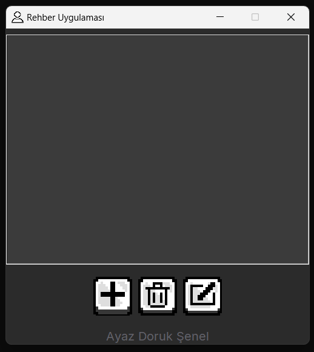

# 📇 Kişi Rehberi Uygulaması

Bu uygulama, Python ve Tkinter kullanılarak geliştirilmiş basit bir kişi rehberi uygulamasıdır.
## 🚀 Özellikler

- **Kişi Ekleme:** İsim, telefon numarası ve e-posta bilgileri ile yeni kişiler ekleyin.
- **Kişi Güncelleme:** Mevcut bir kişinin bilgilerini düzenleyin.
- **Kişi Silme:** Rehberden istediğiniz kişiyi kolayca kaldırın.
- **Kayıt Saklama:** Kaydedilen kişiler, uygulama kapatıldığında dahi korunur.

## 🖥️ Ekran Görüntüsü



## 🛠️ Kurulum

1. Bu projeyi bilgisayarınıza klonlayın:
    ```bash
    git clone https://github.com/ayazdoruck/python-kisi-rehberi.git
    ```
2. Projenin klasörüne girin:
    ```bash
    cd python-kisi-rehberi-main
    ```
3. Uygulamayı çalıştırın:
    ```bash
    python app.py
    ```

## 📂 Proje Yapısı

- `app.py` - Uygulamanın ana dosyası.
- `rehber.json` - Kişi bilgilerini saklamak için kullanılan veri dosyası.
- `icon.png` - Uygulamanın ikonu.
- `icon-add.png` - Uygulamanın ekle butonunun ikonu.
- `icon-delete.png` - Uygulamanın sil butonunun ikonu.
- `icon-edit.png` - Uygulamanın düzenle butonunun ikonu.

## 💡 Kullanım

- **Yeni Kişi Ekle:** `Ekle` butonuna tıklayın, bilgileri girin ve kaydedin.
- **Kişi Güncelleme ve Silme:** Güncellemek veya silmek istediğiniz kişinin bilgilerini seçin ve ilgili butona tıklayın.


---

**Kişi Rehberi Uygulaması** ile dijital rehberinizi oluşturun!
